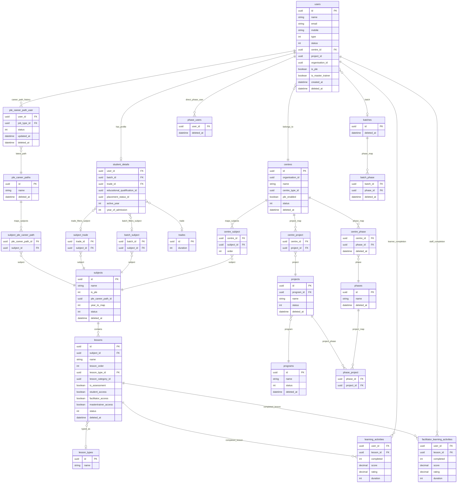

# production_user_one_record_subject_project_combo.sql

This note documents `production_user_one_record_subject_project_combo.sql`, the MySQL 8 query used by `run_production_users_by_centre.py` to produce one analytics row per active user.

The query answers this question:

> For each active user in scope, what learning content was allocated, what has been completed, what project/phase combinations belong to the user, and what subject-level completion summary should be stored as JSON?

## Quick Summary

- Final grain: one row per `user_id`.
- Source DB: production MySQL.
- Required MySQL version: MySQL 8 or newer, because the SQL uses CTEs, `ROW_NUMBER()`, `JSON_ARRAYAGG()`, and `JSON_OBJECT()`.
- Main output table used by the runner: `production_users_one_record`.
- Main dynamic parameters: `user_id`, `centre_id`, `batch_id`, `subject_id`, `trade_id`, `project_id`, `program_id`, `phase_id`.
- `subject_combos` is JSON and is only populated when the user has completed at least one non-assessment lesson.
- `project_combos` is JSON and is populated from active centre/project/program and phase mapping data.

## How The Runner Uses This SQL

The SQL starts with a `params` CTE. The Python runner reads this file as a template and replaces values inside `params`.

For centre mode:

```sql
user_id = NULL
centre_id = current centre ID
batch_id = NULL
```

For user mode:

```sql
user_id = current user ID
centre_id = NULL
batch_id = NULL
```

The other optional params remain `NULL` unless the SQL file is edited manually:

- `subject_id`
- `trade_id`
- `project_id`
- `program_id`
- `phase_id`

`NULL` means no filter for that field.

## Parameter Reference

| Parameter | Used for | Effect when non-null |
|---|---|---|
| `user_id` | Single-user scoped run | Filters `users.id` to one user |
| `centre_id` | Centre scoped run | Filters `users.centre_id` and active centres |
| `batch_id` | Batch scoped run | Filters `student_details.batch_id` |
| `subject_id` | Subject scoped output | Filters allocation to one subject |
| `trade_id` | Trade scoped run | Filters `student_details.trade_id` |
| `project_id` | Project scoped project/phase JSON | Filters project mappings |
| `program_id` | Program scoped project JSON | Filters active projects by program |
| `phase_id` | Phase scoped project/phase JSON | Filters phase mappings |

## Final Output Columns

The final `SELECT` returns these columns:

| Column | Meaning |
|---|---|
| `user_id` | User UUID |
| `user_type` | User type from `users.type`; expected values are 1, 2, 3, 4 |
| `centre_id` | User's centre |
| `organisation_id` | User's organisation |
| `is_ple` | Whether the user is PLE-enabled |
| `created_at` | User creation timestamp |
| `batch_id` | Learner/alumni batch from `student_details` |
| `trade_id` | Learner/alumni trade from `student_details` |
| `total_allocated` | Allocated lessons plus assessments after filters |
| `total_lessons_allocated` | Allocated non-assessment lessons |
| `total_assessments_allocated` | Allocated assessments |
| `total_completed` | Completed lessons plus assessments |
| `total_lessons_completed` | Completed non-assessment lessons |
| `total_assessments_completed` | Completed assessments |
| `completion_pct` | `total_completed / total_allocated * 100` |
| `project_combos` | JSON array of program/project/phase combinations |
| `subject_combos` | JSON array of subject-level completion summaries |

The SQL comments out some available user fields such as `user_name`, `email`, and `mobile`. They are available in `one_user_row` but intentionally not returned in the final output.

## High-Level Flow

```mermaid
flowchart TD
    params[params]
    users[active_users]
    career[latest_career_path]
    nonple[non_ple_allocation]
    ple[ple_allocation]
    staff[staff_allocation]
    unioned[allocation_union]
    dedup[allocation_dedup]
    filtered[allocation_filtered]
    learner[learner_completion]
    staffcomp[staff_completion]
    compdedup[completion_dedup]
    merged[merged]
    usummary[user_summary]
    subjalloc[subject_allocation_summary]
    subjcomp[subject_completion_summary]
    completed[completed_lesson_rows]
    zerocomp[zero_completion_subject_rows]
    lessonout[lesson_output]
    subjout[subject_output]
    projects[user_project_combos]
    subjects[user_subject_combos]
    onerow[one_user_row]
    final[final one row per user]

    params --> users
    users --> career
    users --> nonple
    users --> ple
    users --> staff
    career --> ple
    nonple --> unioned
    ple --> unioned
    staff --> unioned
    unioned --> dedup
    dedup --> filtered
    users --> learner
    users --> staffcomp
    learner --> compdedup
    staffcomp --> compdedup
    filtered --> merged
    compdedup --> merged
    merged --> usummary
    merged --> subjalloc
    merged --> subjcomp
    usummary --> completed
    subjalloc --> completed
    subjcomp --> completed
    usummary --> zerocomp
    subjalloc --> zerocomp
    completed --> lessonout
    zerocomp --> lessonout
    lessonout --> subjout
    subjout --> subjects
    users --> projects
    users --> onerow
    onerow --> final
    projects --> final
    subjects --> final
```



## ERD

This ERD is focused on the relationships used by this SQL, not every column in the source database.



## CTE Reference

### `params`

Single-row CTE that holds runtime filters. The Python runner edits this CTE before execution.

Important convention:

- `CAST(NULL AS CHAR(36))` means no filter.
- UUID literals are injected with `_utf8mb4'...' COLLATE utf8mb4_unicode_ci` to avoid collation mismatch issues during joins and comparisons.

### `active_users`

Builds the user population in scope.

Source tables:

- `users`
- `student_details`

Filters:

- `users.type IN (1, 2, 3, 4)`
- `users.status = 1`
- `users.deleted_at IS NULL`
- optional filters from `params`: user, centre, batch, trade

User type interpretation used by the query:

| `user_type` | Meaning in this SQL | Completion source |
|---|---|---|
| 1 | Admin/staff | `facilitator_learning_activities` |
| 2 | Facilitator or master trainer | `facilitator_learning_activities` |
| 3 | Learner | `learning_activities` |
| 4 | Alumni | `learning_activities` |

### `latest_career_path`

Finds one active PLE career path per user.

Logic:

- reads `ple_career_path_user`
- keeps rows with `status = 1` and `deleted_at IS NULL`
- ranks by `updated_at DESC`
- keeps `ROW_NUMBER() = 1`

This is used only by the PLE allocation path.

### `non_ple_allocation`

Builds allocated lessons for learner/alumni users who are not PLE.

Eligible users:

- `user_type IN (3, 4)`
- `is_ple IS NULL OR is_ple != 1`

Subject path:

```text
active_users
-> centre_subject
-> subjects
-> lessons
```

Optional narrowing:

- if user has `batch_id`, subject must exist in `batch_subject`
- if user has `trade_id`, subject must exist in `subject_trade`
- if subject has `year_to_map`, it must be within `trades.duration`

Subject filter:

- `subjects.status = 1`
- `subjects.deleted_at IS NULL`
- `subjects.is_ple IN (0, 2)`

Lesson filter:

- `lessons.status = 1`
- `lessons.deleted_at IS NULL`
- `lessons.student_access = 1`
- `lessons.lesson_category_id = 'd78bc322-568f-4110-8e24-02ea444d48b7'`

Output marker:

- `allocation_path = 'non_ple'`

### `ple_allocation`

Builds allocated lessons for learner/alumni users who are PLE.

Eligible users:

- `user_type IN (3, 4)`
- `is_ple = 1`
- has latest active career path

Subject path:

```text
active_users
-> latest_career_path
-> ple_career_paths
-> centre_subject
-> subject_ple_career_path
-> subjects
-> lessons
```

Required PLE mapping:

- `pcp.id IS NOT NULL`
- `spcp.subject_id IS NOT NULL`

Optional narrowing:

- if user has `batch_id`, subject must exist in `batch_subject`
- `year_to_map` must be within `trades.duration` when applicable

Subject filter:

- `subjects.status = 1`
- `subjects.deleted_at IS NULL`
- `subjects.is_ple IN (1, 2)`

Lesson filter:

- active, non-deleted lessons
- `student_access = 1`
- same hard-coded lesson category

Output marker:

- `allocation_path = 'ple'`

### `staff_allocation`

Builds allocated lessons for staff users.

Eligible users:

- `user_type IN (1, 2)`

Subject path:

```text
active_users
-> centre_subject
-> subjects
-> lessons
```

Access rules:

| Staff case | Rule |
|---|---|
| Admin, `user_type = 1` | all active lessons in the centre |
| Facilitator, `user_type = 2` and not master trainer | only `lessons.facilitator_access = 1` |
| Master trainer, `user_type = 2` and `is_master_trainer = 1` | only `lessons.mastertrainer_access = 1` |

Output marker:

- `allocation_path = 'staff'`

### `allocation_union`

Combines the three allocation paths:

- `non_ple`
- `ple`
- `staff`

Uses `UNION ALL`, so duplicates are possible at this stage.

### `allocation_dedup`

Deduplicates allocation to one row per `(user_id, lesson_id)`.

Ranking:

```sql
ROW_NUMBER() OVER (
    PARTITION BY user_id, lesson_id
    ORDER BY career_path_updated_at DESC, lesson_order ASC
)
```

This mainly protects against duplicate PLE/career-path or mapping overlaps.

### `allocation_filtered`

Removes unwanted lesson types from output:

- `pdf`
- `mp4`
- `pdf web`

The comparison is normalized with `LOWER(TRIM(lesson_type))`.

### `learner_completion`

Aggregates completed learner/alumni activity.

Source:

- `learning_activities`

Eligible users:

- users from `active_users`
- `user_type IN (3, 4)`

Filter:

- `completed = 1`

Aggregation grain:

- `(user_id, lesson_id)`

Metrics:

- `MAX(score)`
- `MAX(rating)`
- `SUM(duration)`

### `staff_completion`

Aggregates completed staff activity.

Source:

- `facilitator_learning_activities`

Eligible users:

- users from `active_users`
- `user_type NOT IN (3, 4)`

Filter and aggregation are the same as learner completion.

### `completion_dedup`

Combines learner and staff completion rows, then keeps one completion row per `(user_id, lesson_id)`.

Ranking:

```sql
ROW_NUMBER() OVER (
    PARTITION BY user_id, lesson_id
    ORDER BY score DESC
)
```

If duplicate completion rows exist across sources, the highest score wins.

### `merged`

Left joins allocation to completion.

Grain:

- one row per allocated `(user_id, lesson_id)` after filters

Important behavior:

- allocated but incomplete lessons remain in the rowset with `completed = 0`
- completed lessons have `completed = 1`

### `user_summary`

Aggregates completion metrics at user level.

Metrics:

- total allocated lessons and assessments
- allocated lessons only
- allocated assessments only
- total completed
- completed lessons only
- completed assessments only
- completion percentage

### `subject_allocation_summary`

Aggregates allocated counts per `(user_id, subject_id)`.

### `subject_completion_summary`

Aggregates completed counts per `(user_id, subject_id)`.

Only includes rows where `completed = 1`.

### `completed_lesson_rows`

Keeps completed lesson rows and attaches:

- user summary metrics
- subject allocation metrics
- subject completion metrics

### `zero_completion_subject_rows`

Creates one subject-level placeholder row per subject for users whose `total_completed = 0`.

Why this exists:

- users with allocation but zero completion still need allocation counts available for subject-level summarization
- no real `lesson_id` is emitted in these placeholder rows

### `lesson_output`

Combines:

- completed lesson rows
- zero-completion subject placeholder rows

### `no_allocation_user_rows`

Identifies active users that have no allocation after filtering.

Important note:

- This CTE is currently not referenced by the final output path.
- Final output still includes active users through `one_user_row`, with allocation/completion totals defaulting to zero through `COALESCE`.

### `subject_output`

Aggregates `lesson_output` to one row per `(user_id, subject_id)`.

Outputs:

- subject identity
- user summary metrics
- subject allocation counts
- subject completion counts
- average score
- average rating
- average duration
- total duration

### Project And Phase CTEs

These CTEs build `project_combos`.

#### `active_centres`

Active, non-deleted centres, optionally filtered by `params.centre_id`.

#### `centre_project_map`

Maps centres to projects through `centre_project`.

Optional filter:

- `params.project_id`

#### `active_projects`

Active, non-deleted projects.

Optional filter:

- `params.program_id`

#### `active_programs`

Active, non-deleted programs.

#### `main_centre_project`

Produces distinct program/project/centre combinations.

#### `centre_batch`

Extracts one row per active user's `(user_id, batch_id, centre_id)` where `batch_id IS NOT NULL`.

#### `batch_phase_source`

Builds phase rows from batch-based phase mapping.

Path:

```text
active user batch
-> batches
-> batch_phase
-> centre_phase
-> phases
-> phase_project
```

Filters:

- batch, centre phase, batch phase, and phase must be non-deleted
- optional `project_id`
- optional `phase_id`

#### `direct_phase_user_source`

Builds phase rows from direct phase user mapping.

Path:

```text
phase_users
-> active_users
-> centre_phase
-> phases
-> phase_project
```

Filters:

- phase user, centre phase, and phase must be non-deleted
- optional `project_id`
- optional `phase_id`

#### `main_phases`

Combines batch-based phase rows and direct phase-user rows.

#### `user_project_phase_rows`

Joins active users to centre project mappings and phase mappings, then produces distinct project/phase rows per user.

#### `user_project_combos`

Builds JSON:

```json
[
  {
    "prog_name": "...",
    "project_id": "...",
    "proj_name": "...",
    "p_phase_id": "...",
    "phase": "..."
  }
]
```

### `user_subject_combos`

Builds subject-level JSON and carries user-level totals.

JSON shape:

```json
[
  {
    "subject_id": "...",
    "subject_name": "...",
    "avg_score": 80.5,
    "avg_rating": 4.0,
    "completed_lessons_and_assessments": 3,
    "allocated_lessons_and_assessments": 10,
    "allocated_assessments": 2,
    "allocated_lessons": 8,
    "completed_assessments": 1,
    "completed_lessons": 2,
    "year_category": 1
  }
]
```

Important behavior:

- `subject_combos` is populated only when `MAX(total_lessons_completed) > 0`.
- If a user completed only assessments and zero non-assessment lessons, `subject_combos` will be `NULL`.
- User-level totals still default to zero in the final output if no subject summary exists.

### `one_user_row`

Collapses `active_users` to one row per user.

The final query joins this to:

- `user_project_combos`
- `user_subject_combos`

## Allocation Rules By User Type

| User type | User category | Allocation path | Lesson access |
|---|---|---|---|
| 1 | Admin/staff | `staff` | all active centre lessons in the configured lesson category |
| 2 | Facilitator | `staff` | `facilitator_access = 1` |
| 2 | Master trainer | `staff` | `mastertrainer_access = 1` |
| 3 | Learner | `non_ple` or `ple` | `student_access = 1` |
| 4 | Alumni | `non_ple` or `ple` | `student_access = 1` |

## PLE And Non-PLE Subject Rules

| Path | User condition | Subject condition | Extra mapping |
|---|---|---|---|
| `non_ple` | learner/alumni and `is_ple != 1` | `subjects.is_ple IN (0, 2)` | optional batch and trade filters |
| `ple` | learner/alumni and `is_ple = 1` | `subjects.is_ple IN (1, 2)` | required latest career path and `subject_ple_career_path` |
| `staff` | user type 1 or 2 | `subjects.is_ple IN (0, 1, 2)` | lesson access flag depends on staff type |

## Completion Rules

| User category | Source table | Required flag |
|---|---|---|
| Learner/alumni, `user_type IN (3, 4)` | `learning_activities` | `completed = 1` |
| Staff, `user_type IN (1, 2)` | `facilitator_learning_activities` | `completed = 1` |

Completion is joined to allocation by:

```sql
completion.user_id = allocation.user_id
completion.lesson_id = allocation.lesson_id
```

This means a completion only counts if that lesson is also allocated after all allocation filters.

## Hard-Coded Lesson Category

All three allocation paths filter lessons to:

```sql
l.lesson_category_id = 'd78bc322-568f-4110-8e24-02ea444d48b7'
```

If a future programme needs a different category, this should be parameterized or clearly documented before changing.

## Excluded Lesson Types

After allocation deduplication, the query removes these lesson types:

- `pdf`
- `mp4`
- `pdf web`

This affects both allocated and completed counts because the filter is applied before completion aggregation is merged into summaries.

## Operational Notes

### Centre-by-centre runs

Recommended command for append/resume mode:

```bash
python3 run_production_users_by_centre.py \
  --centre-sql-path sql_queries/centre_ids.sql \
  --target-table production_users_one_record \
  --workers 2 \
  --skip-existing
```

Recommended command for full rebuild:

```bash
python3 run_production_users_by_centre.py \
  --centre-sql-path sql_queries/centre_ids.sql \
  --target-table production_users_one_record \
  --replace-target \
  --workers 4
```

### User-by-user runs

Use this for an explicit user list where users should only be processed if they are not already present:

```bash
python3 run_production_users_by_centre.py \
  --user-sql-path sql_queries/user_ids.sql \
  --target-table production_users_one_record \
  --workers 2 \
  --skip-existing
```

Use this for incremental learning-activity refreshes where existing users must be refreshed without creating duplicate user rows:

```bash
python3 run_production_users_by_centre.py \
  --target-table production_users_one_record \
  --workers 1 \
  --incremental-users
```

## Maintenance Checklist

When changing this SQL, review these areas:

- Does the final grain remain one row per user?
- Did any change alter the meaning of `total_allocated` or `total_completed`?
- Did any change affect `subject_combos` null behavior?
- Are PLE and non-PLE allocation paths still mutually understandable?
- Does staff allocation still respect facilitator/master-trainer access flags?
- Does the hard-coded `lesson_category_id` still apply?
- Are `pdf`, `mp4`, and `pdf web` still meant to be excluded?
- Does the Python runner still replace the intended `params` rows?
- If a new output column is added, does the destination table rebuild path need to be run with `--replace-target`?

## Known Caveats

- `no_allocation_user_rows` is defined but is not directly referenced later.
- `subject_combos` requires at least one completed non-assessment lesson because it checks `MAX(total_lessons_completed) > 0`.
- Running without `--replace-target` appends rows. Use `--skip-existing` for resume-safe centre/user processing.
- Parallel workers increase source DB and SSH tunnel load. Start with `--workers 2`; use `--workers 4` only when the server and DB are stable.
